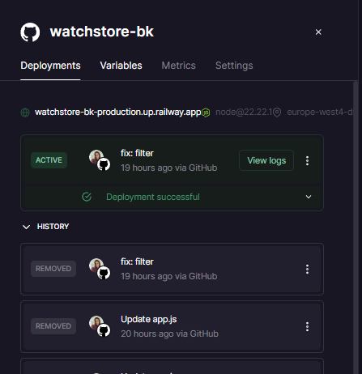
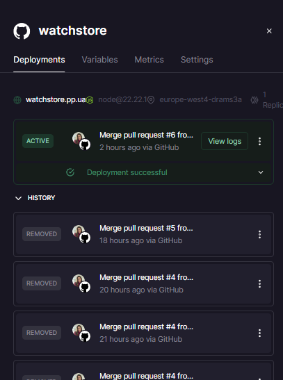
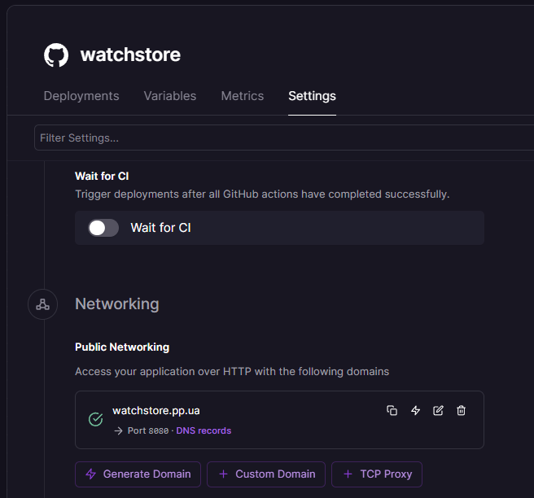
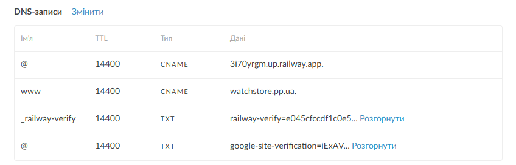
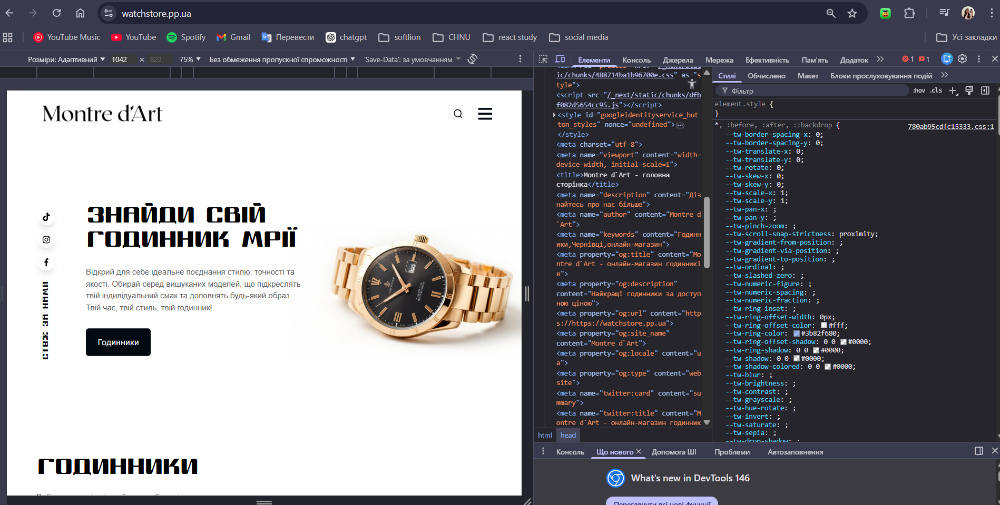
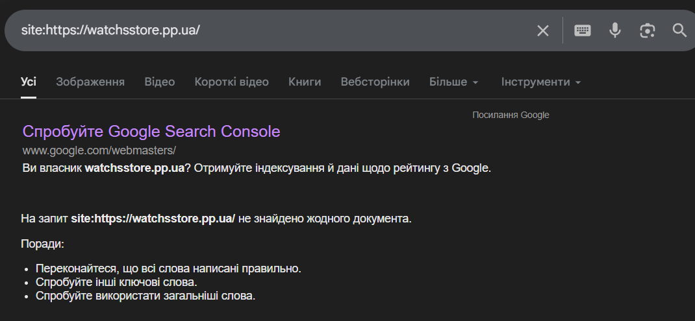
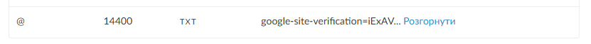
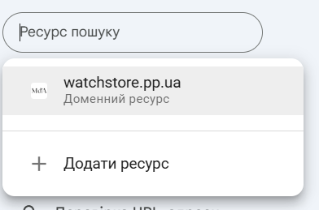
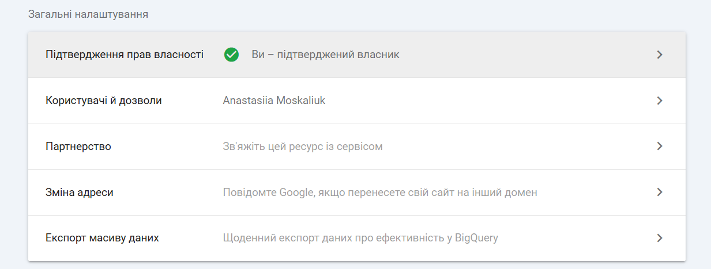
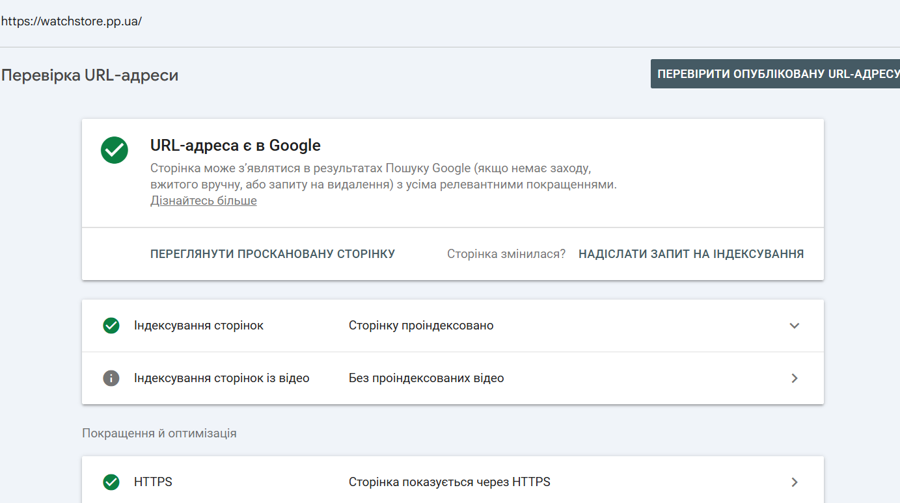

# Звіт з лабораторної роботи №1
**Тема:** Розгортання Fullstack-проєкту, налаштування власного домену та аналіз індексації пошуковими системами

---

### 1. URL розгорнутого сайту на Railway
Бекенд-сервер успішно деплоєний і працює в хмарному середовищі 24/7.
* **Link Backend:** [https://watchstore-bk-production.up.railway.app](https://watchstore-bk-production.up.railway.app)

---

### 2. Назва зареєстрованого домену
Для фронтенд-частини налаштовано власний домен, що забезпечує професійний доступ до ресурсу.
* **Domain:** [https://watchstore.pp.ua](https://watchstore.pp.ua)

---

### 3. Скріншот успішного deploy на Railway
*Опис: Підтвердження статусу "Active" у панелі керування Railway для сервісу watchstore-bk.*

* 
* 

---

### 4. Підключення домену до Railway
Налаштування Railway:

**Image:** 

Налаштування домену:

**Image:** 

### 5. Дослідження - "Що бачить Google"

### curl запит
Отриманий HTML у файл:

[html](./curl-result.txt)

### Таблиця аналізу елементів

| Елемент | Присутній | Що містить / Значення |
| :--- | :---: | :--- |
| **Текст** | ✅ Так | Назва ціна опис. |
| **Заголовок `<title>`** | ✅ Так | Магазин годинників. |
| **Опис `<meta description>`** | ✅ Так | Найкращі годинники за доступною ціною |
| **Вміст `<body>`** | ✅ Так | Логотип, меню, товари |

### View Source в браузері
**Image:** 
Різниця: Результат curl запиту та View Source ідентичні. Обидва показують HTML який повернув сервер до виконання JS.

### Google Cache перевірка
Зафіксувати - чи знайдено сайт, як виглядає сніпет

**Image:** 

### 6. Скріншот верифікації в Google Search Console
Додано verification:
**Image:** 

Сайт:

**Image:** 

Власник:

**Image:** 

### 7. Скріншот запиту на індексацію

**Image:** 

### 8. Відповідь на питання: "Що побачить Google crawler на вашому сайті і чому це може бути проблемою?"

1. **Що побачить Google crawler на моєму сайті?**
Наразі Google побачить лише «порожню оболонку» сторінки. Замість готового тексту статті про годинники, пошуковий робот отримає технічний каркас і «скелетні» анімації завантаження. Для нього сайт виглядає як заготовка, на якій ще немає реального контенту.

2. **Чому це є проблемою?**
* Контент «невидимий» для пошуку: Оскільки текст статті з'являється лише в браузері користувача за допомогою JavaScript, Google при першому скануванні не бачить ключових слів. Якщо бот не бачить слів «годинники», «стиль» або «аксесуари» безпосередньо в коді, він не знає, за якими запитами показувати сайт людям.
* Затримка в просуванні: Роботу доводиться витрачати набагато більше часу та ресурсів, щоб спробувати «відрендерити» сторінку і знайти прихований текст. Це значно сповільнює появу сайту в результатах пошуку.
* Ризик низького рейтингу: Пошуковики надають перевагу сайтам, які віддають контент миттєво. Сторінка, що виглядає порожньою при завантаженні, отримує менший кредит довіри від Google, що заважає їй потрапити в топ видачі.