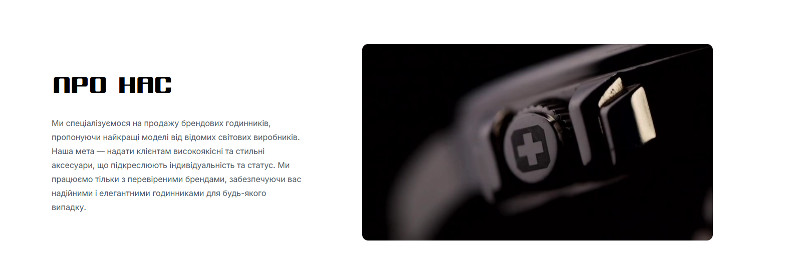
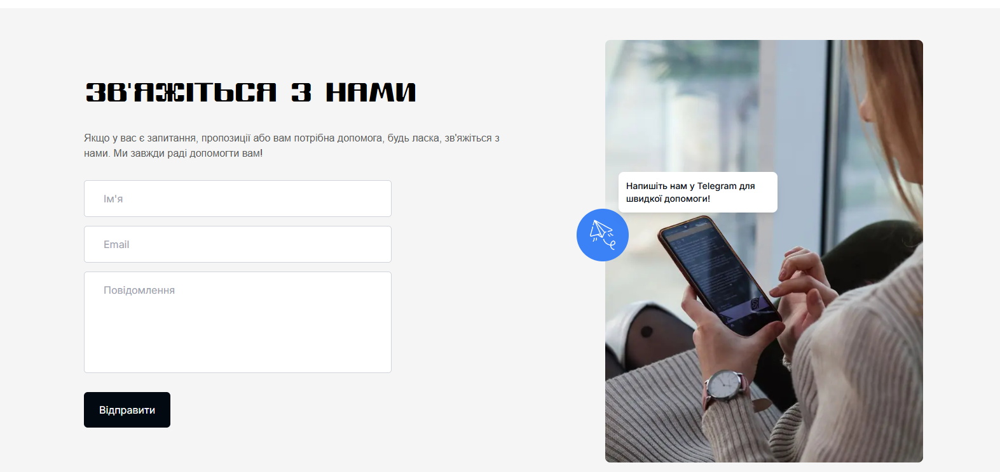
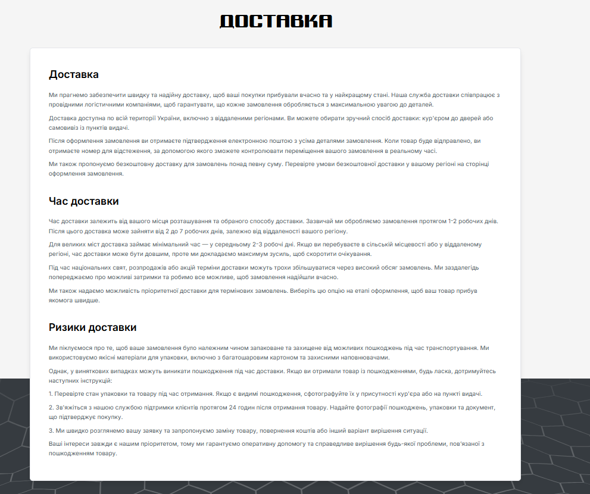
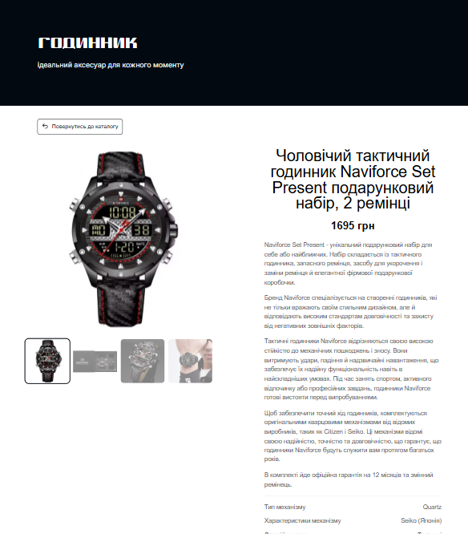
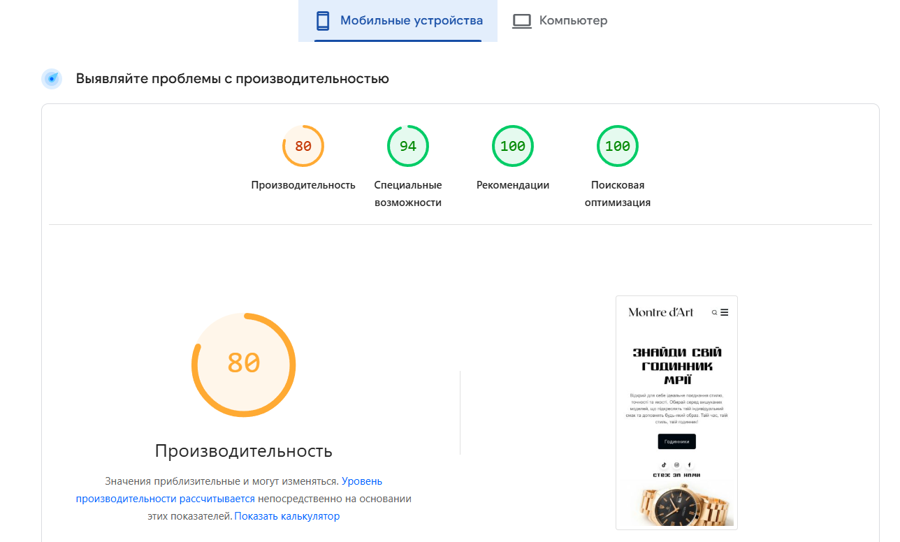
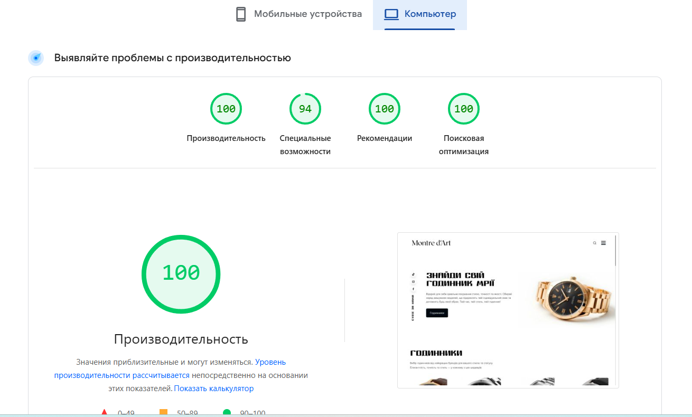

# Звіт з лабораторної роботи №2
**Тема:** Індексація та алгоритми Google

---

### 1. Перевірка поточного стану індексації

### URL Inspection у GSC

| Параметр | Значення |
| :--- | :---: | 
|**Статус індексації**| сторінку проіндексовано |
| **Дата останнього crawl** | ✅ Так | 
| **Метод виявлення URL**| 8 квіт. 2026 р., 16:56:58 | 
|**Чи дозволено індексацію robots.txt**| ✅ Так | 
|**Чи є canonical**| ✅ Так | 
|**Статус рендерингу (screenshot)**| | 

**Image:** 

### Перевірка через пошукові оператори
Виконати наступні запити в Google та зафіксувати результати:

* site:ваш-домен.pp.ua
* cache:ваш-домен.pp.ua
* info:ваш-домен.pp.ua

**Image:** 

**Image:** 

**Image:** 

| Оператор | Що це означає | 
| :--- | :---: |
|**site:**| Використовується для перевірки індексації сайту (які сторінки є в Google) |
| **cache:** | Дає можливість побачити, як сторінка виглядала під час останнього сканування Google | 
| **info:**| Дає загальну інформацію про сторінку в пошуковій системі (індексація, кеш, схожі сторінки) | 

 > Очікуваний результат: сайт може ще не з'явитись у результатах - це нормально для нового домену. Важливо зафіксувати поточний стан і розуміти чому так відбувається.

### Аналіз статусів Coverage Report

| Статус | Пояснення | Можлива причина|
| :--- | :---: | :---: | 
|**Submitted and indexed**| Сторінка успішно додана в індекс і може з’являтися в пошуку |Все працює правильно, сторінка доступна і не має обмежень |
| **Crawled - currently not indexed** | Сторінку просканували, але поки не додали в індекс | Низька якість контенту, дублікат, або Google вирішив, що сторінка неважлива | 
| **Discovered - currently not indexed**|Google знає про сторінку, але ще не відвідував її | Новий сайт, мало ресурсів crawl budget або мало внутрішніх/зовнішніх посилань |
|**Excluded by noindex tag**| Сторінка має тег noindex, тому не додається в пошукї | Спеціально встановлений meta-тег noindex або HTTP-заголовокь |
|**Blocked by robots.txt**| Сторінка заблокована для сканування через robots.txt | У файлі robots.txt заборонено доступ до цієї сторінки |
|**Redirect error**|Помилка при перенаправленні сторінки | Неправильний редірект, цикл редіректів або битий URL |
|**404 Not Found**|Сторінка не існує | Неправильне посилання або сторінку видалили |
|**Soft 404**| Сторінка виглядає як існуюча, але фактично порожня або без корисного контенту |  Порожня сторінка, сторінка з текстом "нічого не знайдено" без правильного статусу 404 |

### 2. Аналіз алгоритмів Google на реальних прикладах

Для кожного алгоритму знайти реальний кейс (новина, кейс-стаді, форум) де сайт постраждав або виграв після оновлення. Заповніть таблицю:

| Алгоритм | Рік запуску | На що впливає | Реальний кейс (посилання) | Що треба робити |
| :--- | :---: |:---: | :---: |:---: |
|**Panda**|2011| Якість контенту (дублі, "thin content") | https://www.searchenginewatch.com/2013/08/07/google-panda-penguin-phantom-3-recovery-examples/ | Писати унікальний, корисний контент, прибрати дублікати та "тонкі" сторінки |
| **Penguin** | 2012 | Посилання (спамні беклінки, куплені лінки) | https://www.linkbuildr.com/google-penguin-recovery-case-study/ | Видалити або disavow неякісні лінки, не купувати посилання |
| **BERT**| 2019 | Розуміння запитів (контекст, природна мова) | https://www.searchenginejournal.com/google-bert-update/324520/ | Писати для людей, відповідати на запити природною мовою, фокус на сенсі |

### 3. Впровадження E-E-A-T у проєкт

E-E-A-T (Experience, Expertise, Authoritativeness, Trustworthiness) — це набір сигналів, за якими Google оцінює якість та надійність сайту.
Завдання: впровадити E-E-A-T елементи для сайту магазину годинників Montre d`Art.

### Створити та наповнити сторінку /about та /contact , яка містить:

* Назва  та опис:
   * Montre d`Art 
   * інтернет-магазин годинників
* Коротка історія:
   * мета сервісу
   * спеціалізація
* Опис сайту :
   * продаж брендових годинників від провідних світових виробників.
   * Забезпечення клієнтів статусними аксесуарами високої якості.
* Місія:
   * Якість та статус: Надання високоякісних аксесуарів від світових брендів, що підкреслюють індивідуальність клієнта.
   * Надійність: Робота виключно з перевіреними виробниками для гарантії елегантності та довговічності годинників.
* ВІдео:
   * Естетика та деталі: Візуальна презентація годинника в деталях.
   * Процес: Відеоогляд, що демонструє якість виконання.
* Соціальні мережі:
   * Instagram
   * Facebook
   * Tik tok
* Контактна інформація:
   * Кнопка зв’язку 
   * Форма 

**About Us:** 
**Contact:** 

### Сторінка "Доставка та оплата" /delivery

Cторінка /delivery містить:
* Зона доставки:
   * Уся територія України
* Час доставки:
   * Обробка замовлення: 1–2 робочих дні.
   * Транспортування: 2–7 робочих днів.
* Мінімальне замовлення: 700 грн.
* Умови безкоштовної доставки: 
   * Надається при замовленні на суму понад встановлений ліміт (деталі на сторінці оформлення).
* Способи оплати:
   * Готівка (при отриманні).
   * Картка (через термінал).
   * Онлайн-оплата (ще в розробці).
* Додаткові умови:
   * При затримці: Ми заздалегідь попереджаємо про зміну термінів під час свят чи розпродажів. Для термінових запитів доступна пріоритетна доставка.
   * При пошкодженні/помилці: Сфотографувати товар при отриманні та зв’язатися з підтримкою протягом 24 годин для заміни або повернення коштів.

**Delivery:** 

### Сторінки страв /product/[slug]

Для кожної страви реалізовано:
* Назва страви
* Реальне фото
* Опис
* Характеристика
* Ціна

**Product:** 

###  E-E-A-T чек-ліст

* Experience (Досвід)
   * Індивідуальний підхід: Кожне замовлення обробляється з максимальною увагою до деталей.
   * Практичність: Пряма спеціалізація на аксесуарах для підкреслення статусу.
   * Швидкий сервіс: відпрацьована система обробки та відправки замовлень за 1–2 дні

* Expertise (Експертиза)
   * Фокус на брендах: Глибока спеціалізація на продажу годинників відомих світових виробників.
   * Технічні деталі: Чіткий опис характеристик кожної моделі (механізм, скло, ремінець).
   * Професійна підтримка: Швидка консультація через кнопку зв’язку.

* Authoritativeness (Авторитетність)
   * Структурованість: Наявність чітких розділів «Про нас» та «Доставка», що пояснюють принципи роботи.
   * Соціальний доказ: Прямі посилання на активні сторінки в Instagram та Facebook.
   * Репутація: Робота з брендами, які мають світове визнання.

* Trustworthiness (Надійність)
   * Технічна безпека: Сайт працює на захищеному протоколі HTTPS.
   * Зворотний зв'язок: У футері вказано прямий номер телефону та є кнопка швидкого зв’язку.
   * Прозорість умов: Чітко прописані терміни доставки (1–2 дні на обробку) та алгоритм вирішення проблем із замовленням.
   * Фінансова гнучкість: Можливість оплати готівкою, карткою або онлайн.

# 4. Базовий Lighthouse звіт

Цей крок фіксує поточний стан продуктивності сайту до будь-якої оптимізації. Ці дані будуть точкою порівняння в майбутніх лабораторних.

### Запустити PageSpeed Insights

Результати: https://pagespeed.web.dev/analysis/https-watchstore-pp-ua/ukhiy58980?form_factor=mobile

Результат Mobile:

Результат Desktop:

### Зафіксувати показники
| Метрика | Mobile | Desktop |
| :--- | :---: | :---: | 
|**Performance Score**| 80 | 100 | 
| **SEO Score** | 100 | 100 |
| **Accessibility Score**| 94 | 94 |
|**Best Practices Score**| 100 | 100 |
|**LCP (Largest Contentful Paint)**| 4,8s | 0,7s |
|**CLS (Cumulative Layout Shift)**| 0 | 0,023 |
|**INP (Interaction to Next Paint)**| | |
|**FCP (First Contentful Paint)**|1,4s | 0,3s |
|**TTFB (Time to First Byte)**| 0 | 0 |

### Аналіз результатів
1. Які метрики у червоній зоні? Що це означає для користувача?
* 🔴 LCP (4.8s на Mobile)
Це означає, що основний контент сторінки завантажується дуже довго.
Користувач бачить "порожній" екран або довго чекає → може піти з сайту.

2. Які три проблеми PageSpeed вважає найкритичнішими?
* Повільний LCP: Відео на фоні або головне зображення не оптимізовані для смартфонів.
* Затримка FCP (1.4s): Початок появи контенту на мобільному в 4 рази повільніший, ніж на ПК.

3. Порівняння Mobile vs Desktop
* Mobile (80) значно нижчий за Desktop (100) через:
   * Слабше залізо: Мобільні процесори повільніше обробляють відео та важкі скрипти сайту.
   * Швидкість мережі: Мобільний інтернет збільшує час очікування (LCP) у 7 разів (з 0,7с до 4,8с).
   * Рендеринг: Десктоп миттєво відмальовує контент, тоді як смартфон витрачає більше ресурсів на адаптацію інтерфейсу.