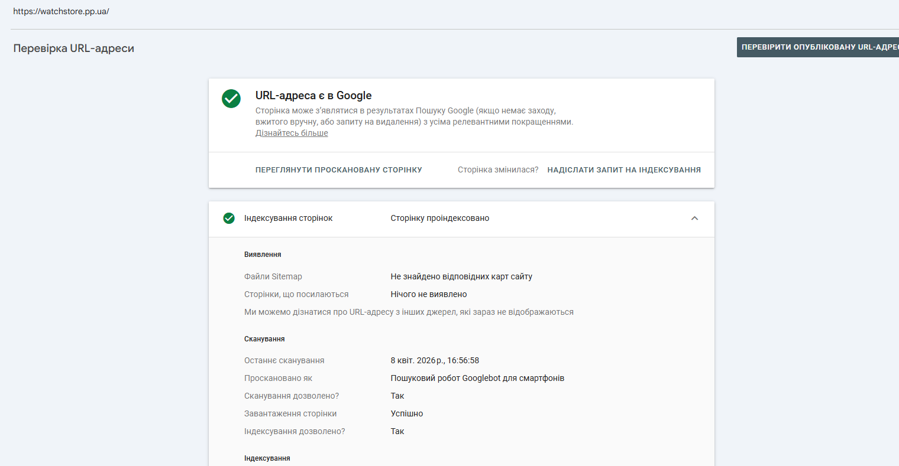
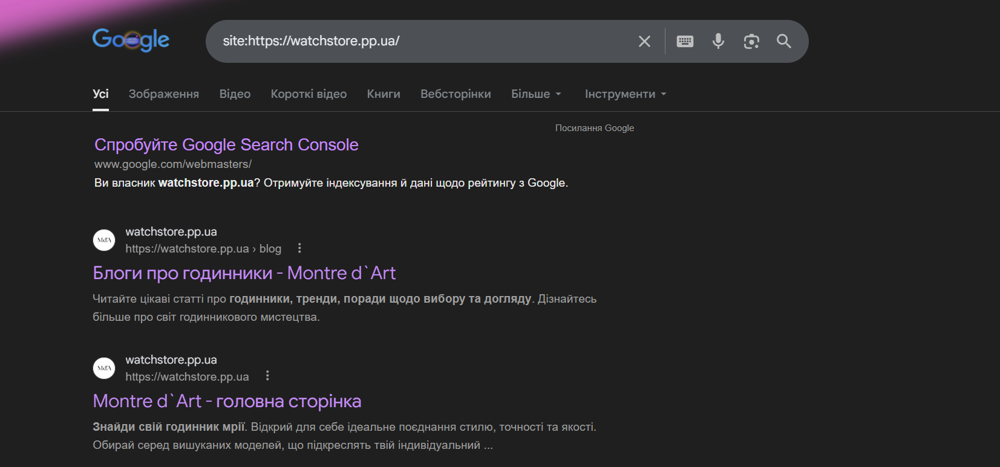

# Звіт з лабораторної роботи №2
**Тема:** Індексація та алгоритми Google

---

### 1. Перевірка поточного стану індексації

### URL Inspection у GSC

| Параметр | Значення |
| :--- | :---: | :--- |
|Статус індексації| сторінку проіндексовано |
| Дата останнього crawl | ✅ Так | 
| Метод виявлення URL| 8 квіт. 2026 р., 16:56:58 | 
|Чи дозволено індексацію robots.txt| ✅ Так | 
|Чи є canonical| ✅ Так | 
|Статус рендерингу (screenshot)| | 

**Image:** 

### Перевірка через пошукові оператори
Виконати наступні запити в Google та зафіксувати результати:

site:ваш-домен.pp.ua
cache:ваш-домен.pp.ua
info:ваш-домен.pp.ua

**Image:** 
