# Звіт з лабораторної роботи №3
**Тема:** Семантичне ядро та структура сайту

---

### 1. Класифікація типів пошукових запитів

### Теоретична база
Перед початком роботи розібратися з типами пошукового інтенту (search intent):

| Тип | Опис | Приклад запиту | Яка сторінка відповідає |
| :--- | :---: | :---: | :---: | 
|**Informational**| Хоче дізнатись | "що таке react hooks" | Стаття, туторіал |
| **Navigational** | Шукає конкретний сайт | "github login" | Головна, про нас |
| **Transactional**| Хоче щось зробити/купити | "завантажити vs code" | Лендінг, сторінка продукту |
|**Commercial**| Порівнює перед рішенням | "next.js vs nuxt порівняння" | Порівняльна стаття |

### Практичне завдання

Для обраної тематики проєкту придумати та класифікувати 20 пошукових запитів. 
Google Sheets: https://docs.google.com/spreadsheets/d/1AnGRlRUTDndnWb8erR_8Ur27L-2UE6fS386Yok5ZdjE/edit?gid=0#gid=0

Вимога: мінімум по 4 запити кожного типу.

### Аналіз через Google Search
Для 3 запитів з таблиці виконати в Google:
* Подивитись блок "People also ask" - зафіксувати 3-5 питань
* Подивитись блок "Related searches" внизу сторінки
* Звернути увагу на autocomplete при введенні запиту
* Додати знайдені запити до таблиці якщо вони релевантні.

* Запит "купити чоловічий годинник"
   * блок "People also ask":
**Image:** 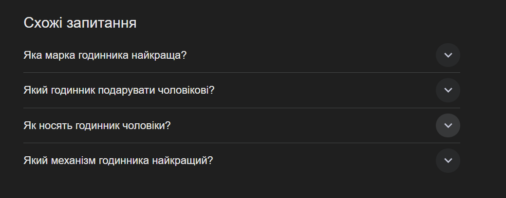

   * блок "Related searches":
**Image:** 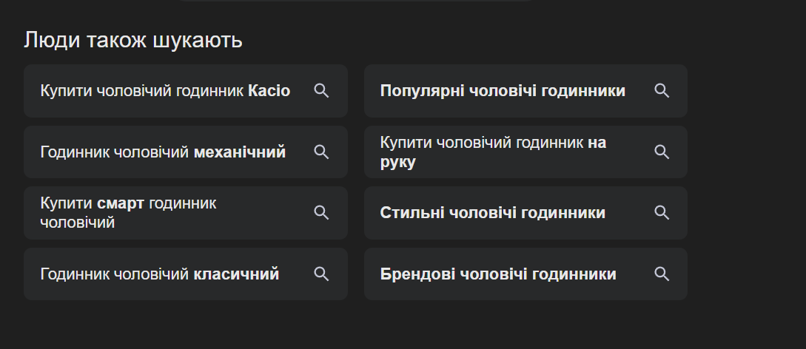

   * autocomplete:
**Image:** 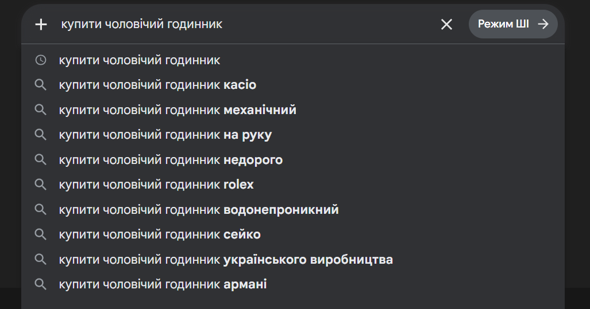

* Запит "топ 10 класичних годинників"
   * блок "People also ask": відсутній

   * блок "Related searches":
**Image:** 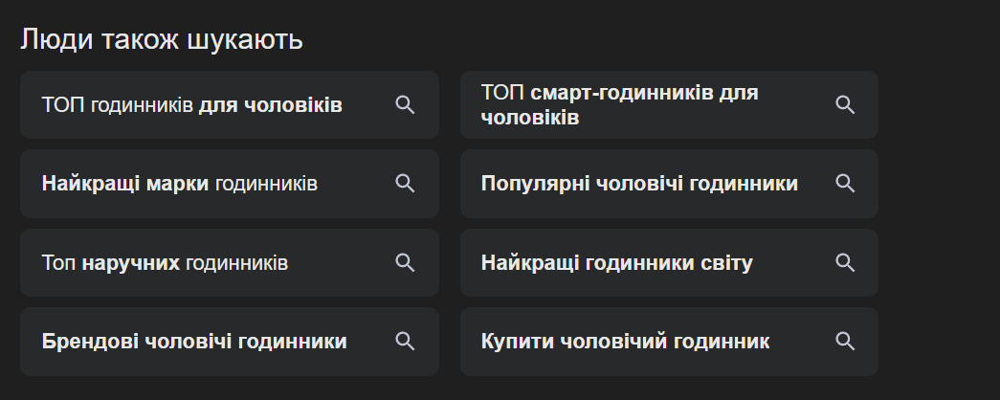

   * autocomplete:
**Image:** 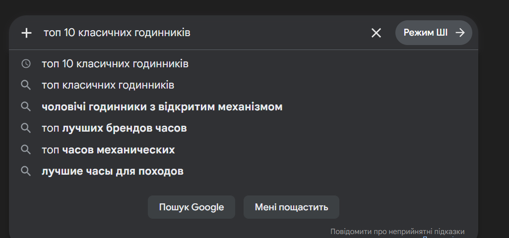

* Запит "механіка чи кварц що краще"
   * блок "People also ask": відсутній

   * блок "Related searches":
**Image:** 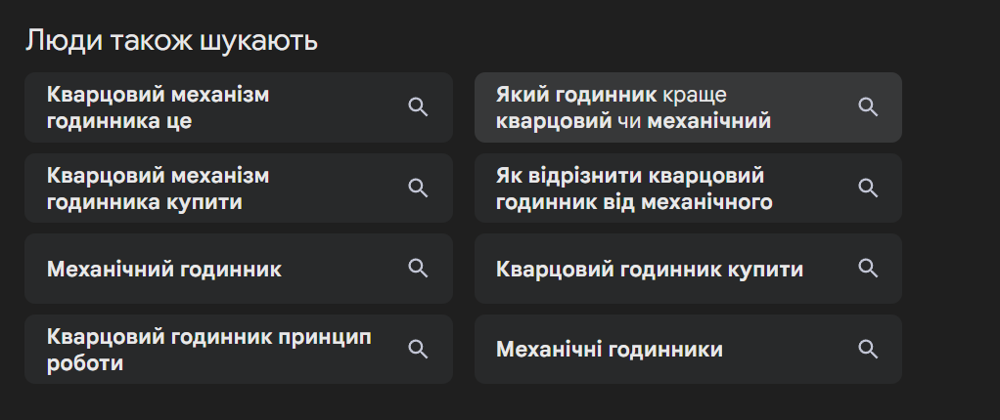

   * autocomplete:
**Image:** 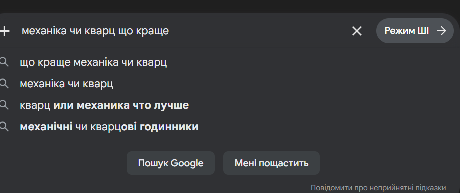

### Збір семантичного ядра

### Структура таблиці
Створити Google Sheets файл та наступними колонками:

| Колонка | Опис | Приклад |
| :--- | :---: | :---: | 
|**keyword**| Ключовий запит |"javascript async await" |
| **intent** | Тип інтенту|informational |
| **volume**| Середньомісячна частотність | 1000-10000 |
|**competition**|Конкурентність (Low/Medium/High) | 	Low |
|**cluster**| Назва кластеру | javascript-basics |
|**target_page**|URL сторінки яка буде під цей запит| /categories/javascript |
|**priority**| Пріоритет (1-3) | 1 |
|**notes**| Нотатки | сезонний запит |

### Збір через Google Keyword Planner

Google Sheets: https://docs.google.com/spreadsheets/d/1AnGRlRUTDndnWb8erR_8Ur27L-2UE6fS386Yok5ZdjE/edit?gid=0#gid=0

### Розширення через Google Trends

> «Чоловічий годинник» vs «Жіночий годинник»: Обидва запити мають стабільно високий базовий інтерес. Проте «жіночий годинник» демонструє більш різкі коливання та вищі піки в періоди свят, тоді як «чоловічий» має більш рівномірний графік протягом року.

**Чоловічий годинник:** 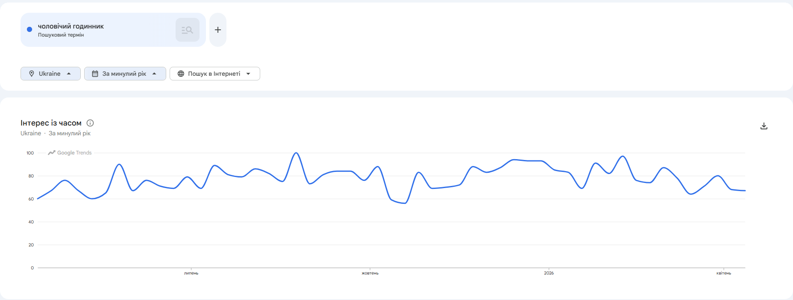
**Жіночий годинник:** 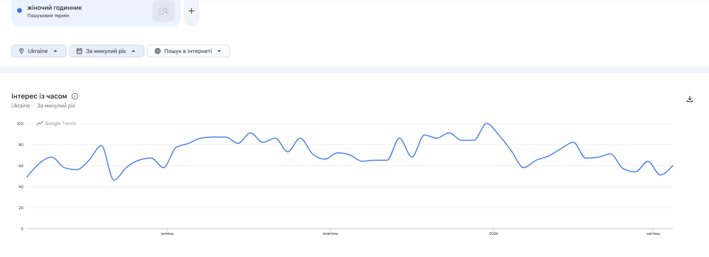

> «Смарт годинник»: Цей запит є найбільш динамічним. Він має чітко виражені періоди зростання, пов'язані з виходом нових моделей гаджетів та передсвятковими розпродажами. На відміну від класичних годинників, він менше залежить від «модних сезонів» і більше від «технологічних циклів».
**Смарт годинник:** 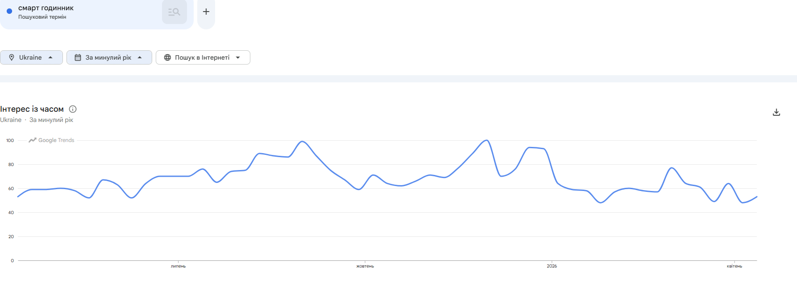

> «Купити годинник»: Це транзакційний запит, який відображає загальну готовність ринку до покупки. Він виступає як усереднений показник попиту і зазвичай корелює з піками конкретних категорій.
**Купити годинник:** 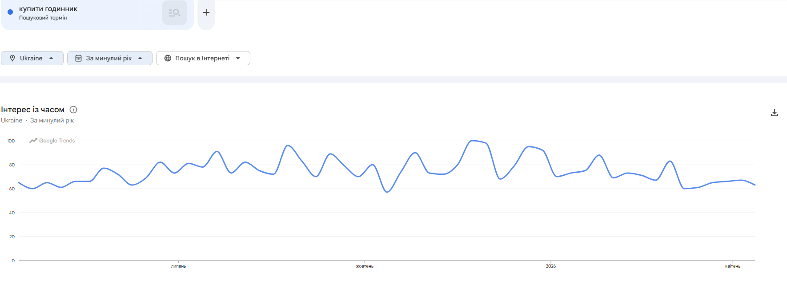

### Кластеризація запитів

| cluster | Кількість запитів | Головний запит (head keyword) | Тип сторінки | Пріоритет |
| :--- | :---: | :---: | :---: | :---: |
|**mens-watches**| 15  | "чоловічий годинник" | catalog | 1 |
| **womens-watches** | 12 | "жіночий годинник" | catalog |  1 |
| **smartwatch**| 20 | "смарт годинник" | catalog |  1 |
|**watches**| 10 | "купити годинник" | homepage |  2 |
|**service**| 6 | "ремонт годинників" | delivery |  3 |
|**blog**| 8 | "як вибрати годинник" | article |  3 |

### Побудова Silo-структури сайту
Silo-структура - це архітектура сайту де сторінки організовані в тематичні силоси (вертикалі), кожен з яких повністю присвячений одній темі. Внутрішні посилання йдуть всередині силосу і підсилюють його тематичний авторитет.

### Структура сайту годинників (Montre d'Art)
На основі своїх кластерів побудувати silo-структуру. Шаблон для заповнення - окремий аркуш "Site Structure" у Google Sheets:

Рівень 0 - Головна

| URL | Назва сторінки | Тип | Head keyword | Опис |
| :--- | :---: | :---: | :---: | :---: |
|**/**| Головна  | home | "купити годинник " | Вітрина з популярними моделями, посилання на головні категорії (чоловічі/жіночі/смарт). |

Рівень 1 - Категорії (силоси)

| URL | Назва сторінки | Тип | Head keyword | Опис |
| :--- | :---: | :---: | :---: | :---: |
|**/category/mens-watches**| Чоловічі годинники  | home | "чоловічий годинник" | /category/smartwatches |
|**/category/womens-watches**| Жіночі годинники  | home | "жіночий годинник" | /category/smartwatches	 |
|**/category/smartwatches**| Смарт годинники  | home | "смарт годинник" | /category/mens-watches, /category/womens-watches |

Рівень 2 - Продукти всередині силосу
| URL | Назва продукту | Категорія | Target keyword | Посилається на | Отримує посилання від |
| :--- | :--- | :--- | :--- | :--- | :--- |
| **catalog/cholovichyi-mekhanichnyi-besta-skeleton** | Besta Skeleton UA Black | mens | "Besta Skeleton UA Black купити" | catalog/mens-watches | catalog/mens-watches |
| **catalog/zhinochyi-hodynnyk-naviforce-party** | Naviforce Party | womens | "жіночий годинник Naviforce Party" | catalog/womens-watches | catalog/womens-watches |
| **catalog/smart-vip-lady-pro-gold** | Smart VIP Lady Pro Gold | smart | "Smart VIP Lady Pro Gold ціна" | catalog/smartwatches | catalog/smartwatches |
| **catalog/smart-flower-new-gold-2-straps** | Smart Flower New Gold | smart | "Smart Flower New Gold" | catalog/smartwatches | catalog/smartwatches |

Рівень 3 - Допоміжні сторінки
| URL | Назва | Тип |
| :--- | :--- | :--- |
| **about-us** | Про магазин | static |
| **delivery** | Доставка та оплата | static |
| **account** | Мій профіль | dynamic |
| **cart** | Кошик | functional |
| **checkout** | Оформлення | functional |
| **contact-us** | Контакти | static |
| **blog** | Блог / Статті | info|

### Схема внутрішніх посилань
На аркуші "Internal Links" описати логіку перелінковки:

| Звідки | Куди | Тип посилання | Анкор текст |
| :--- | :--- | :--- | :--- |
| **/** | catalog/mens-watches | contextual | "купити чоловічий годинник" |
| **/** | catalog/womens-watches | contextual | "купити жіночий годинник" |
| **/** | catalog/smartwatches | contextual | "обрати смарт-годинник" |
| **catalog/mens-watches** | catalog/cholovichyi-besta-skeleton | contextual | "переглянути Besta Skeleton" |
| **catalog/cholovichyi-besta-skeleton** | cart | action | "додати в кошик" |
| **cart** | checkout | action | "оформити замовлення" |
| **about-us** | contact-us | related | "зв'язатися з нами" |
| **catalog/cholovichyi-besta-skeleton** | catalog/mens-watches | breadcrumb | "Чоловічі годинники" |
| **catalog/mens-watches** | / | breadcrumb | "Головна" |
| **/**  | account | info | "мої дані для замовлення" |

Пояснення типів посилань:
* Contextual (контекстні): Посилання, що ведуть до релевантного контенту в межах теми сторінки. Наприклад, з головної на категорії їжі, щоб користувач міг продовжити навігацію по меню.
* Action (дії): Посилання, що ініціюють дії користувача, такі як додавання до кошика, оформлення замовлення або вхід до системи. Вони спрямовані на конверсію.
* Info (інформаційні): Посилання на додаткову інформацію, що допомагає користувачу прийняти рішення, наприклад, умови доставки або профіль користувача.
* Related (пов'язані): Посилання на схожий або супутній контент, що покращує користувацький досвід, наприклад, з "Про нас" на "Доставка".
* Breadcrumb (хлібні крихти): Навігаційні посилання, що показують шлях користувача на сайті, допомагаючи повернутися на попередні рівні (наприклад, з продукту на категорію).

### Перевірка структури
Відповісти на контрольні питання щодо своєї структури:

* 1. Чи кожна категорія є окремим тематичним силосом?
Так. Структура побудована таким чином, що кожна головна категорія (mens-watches, womens-watches, smartwatches) працює як окремий тематичний вузол. Товари всередині категорії посилаються на свою «батьківську» сторінку, а вона, своєю чергою, розподіляє вагу на конкретні моделі. Це допомагає пошуковим системам чітко визначити релевантність кожного розділу.

* 2. Чи є перехресні посилання між різними силосами?
Так, вони є, і вони повністю виправдані. Наприклад, ми додали посилання зі сторінки товару смарт-годинника на категорію accessories (ремінці). Це виправдано з точки зору LSI (латентно-семантичного індексування) та UX (користувацького досвіду), оскільки користувач часто шукає додатковий аксесуар до гаджета. Такі посилання не руйнують силос, а створюють природну логіку допродажів (cross-selling).

* 3. Яка максимальна глибина кліків від головної до будь-якої статті?
Глибина складає 2 кліки. Логіка наступна:
   * Клік 1: З Головної сторінки (/) на розділ Блог (/blog).
   * Клік 2: Зі сторінки списку статей (/blog) на конкретну статтю чи огляд. Це ідеальний показник, оскільки він вкладається в ліміт «не більше 3-х кліків», що забезпечує швидку індексацію та зручність для користувача.

* 4. Чи є orphan pages — сторінки без жодного вхідного посилання?
Ні, таких сторінок немає.
Кожна сторінка в структурі має хоча б одне вхідне посилання:
   * Товари отримують посилання з категорій та хлібних крихт.
   * Категорії отримують посилання з головної сторінки (меню).
   * Допоміжні сторінки (контакти, доставка, акаунт) отримують посилання з футера або сервісних блоків.
   * Статті отримують посилання з головної сторінки блогу.