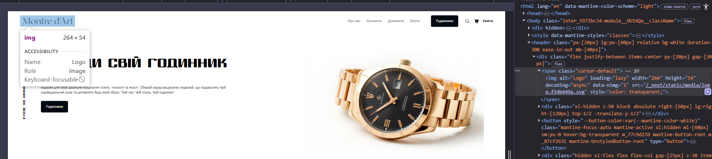
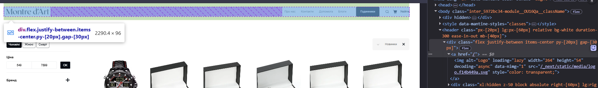
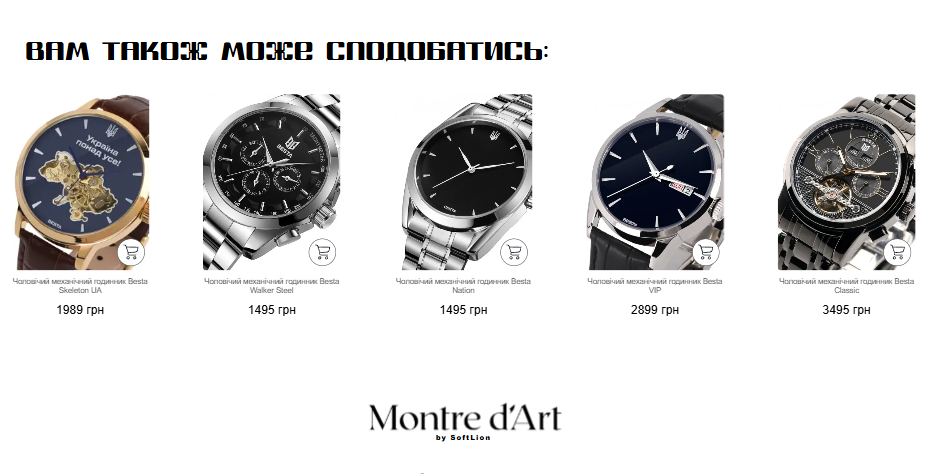

# Звіт з лабораторної роботи №5

**Тема:** Внутрішня перелінковка

---

### Аудит поточної перелінковки

Інвентаризація сторінок

### Таблиця внутрішньої перелінковки (Internal Linking)
Таблиця: https://docs.google.com/spreadsheets/d/1K7FDIvGB5-6aZRfUMtROQGVbVUmyh4hPAyLCB7F4Aro/edit?gid=546920635#gid=546920635

### Таблиця структури та внутрішньої перелінковки

| URL | Тип сторінки | Назва | Вхідні посилання | Вихідні посилання | Статус |
| :--- | :--- | :--- | :---: | :---: | :--- |
| `/` | Головна | Головна сторінка | 2 | 39 | **linked** |
| `/catalog` | Каталог | Каталог товарів | 4 | 25 | **linked** |
| `/catalog/cholovychyi-mekhanichnyi-hodynnyk-besta-skeleton-ua-black` | Товар | Besta Skeleton UA Black | 2 | 14 | **linked** |
| `/blog` | Блог | Список статей  | 1 | 13 | **linked** |
| `/blog/myfy-pro-godynnyky-rozvinchuyemo-populyarni-stereotypy` | Стаття  | Міфи про годинники | 2 | 13 | **linked** |
| `/about` | Статична | Про нас | 1 | 14 | **nav-only** |
| `/delievery` | Статична | Про доставку | 1 | 14 | **nav-only** |
| `/contact-us` | Статична | Зв'язок | 1 | 14 | **nav-only** |

### Виявлення orphan pages

**Orphan pages:** Не виявлено. Усі сторінки мають хоча б одне вхідне посилання.

### Аналіз анкорів
Аналіз 5 вихідних посилань з головної сторінки до категорій та товарів.

| Сторінка-джерело | Анкор текст | URL призначення | Тип анкору | Оцінка |
| :--- | :--- | :--- | :--- | :---: |
| `/` | "Montre d'Art" | `/` | branded | ✅ |
| `/catalog` | "Besta Skeleton UA Black" | `/catalog/besta-skeleton-ua-black` | exact-match | ⚠️ |
| `/` | "Переглянути каталог" | `/catalog` | descriptive | ✅ |
| `/catalog/item` | "Головна → Каталог" | `/catalog` | breadcrumb | ✅ |
| `/` | "купити надійний годинник" | `/catalog` | partial-match | ✅ |
| `/about` | "тут" | `/contact-us` | generic | ❌ |
| `/catalog` | "https://watchstore.pp.ua/catalog" | `/catalog` | naked URL | ❌ |

Типи анкорів для класифікації:

| Тип | Опис | Приклад для годинників | SEO оцінка |
| :--- | :--- | :--- | :---: |
| **exact-match** | Точне входження ключового слова | "чоловічий годинник Besta" | ⚠️ обережно |
| **partial-match** | Часткове входження ключа | "надійні годинники з механізмом" | ✅ |
| **descriptive** | Описовий текст посилання | "як налаштувати механічний годинник" | ✅ |
| **branded** | Назва сайту або бренду | "Montre d'Art" | ✅ |
| **generic** | Неінформативний текст | "тут", "купити", "детальніше" | ❌ |
| **naked URL** | Голе посилання (без тексту) | "https://watchstore.pp.ua/catalog" | ❌ |
| **breadcrumb** | Хлібні крихти (шлях навігації) | "Головна → Каталог" | ✅ |

### Перевірка глибини кліків

| Сторінка | Шлях від головної | Кількість кліків | Статус |
| :--- | :--- | :---: | :--- |
| `/`| `/` | 0 | ✅ |
| `/catalog` | `/` → `/catalog` | 1 | ✅ |
| `/catalog/besta-skeleton-ua-black` | `/` → `/catalog` → `/product-slug` | 2 | ✅ |
| `/blog` | `/` → `/blog` | 1 | ✅ |
| `/blog/myfy-pro-godynnyky-rozvinchuyemo-populyarni-stereotypy` | `/` → `/blog` → `/article-slug` | 2 | ✅ |
| `/about` | `/` → `/about` | 1 | ✅ |
| `/delievery` | `/` → `/delievery` | 1 | ✅ |
| `/contact-us` | `/` → `/contact-us` | 1 | ✅ |

**Висновок:** Усі сторінки сайту знаходяться в межах норми (до 3-х кліків), що забезпечує швидку індексацію.

### Типові помилки - чек-ліст аудиту
Перевірити свій сайт на кожну помилку:

| Помилка | Присутня | Де саме | Як виправити |
| :--- | :---: | :--- | :--- |
| **Orphan pages** | **Ні** | — | — |
| **Generic анкори** | **Ні** | - | - |
| **Посилання на себе** | **Так** | Логотип у хедері на Головній сторінці | Вимкнути посилання для активної сторінки |
| **Зламані посилання** | **Ні** | - | — |
| **Глибина кліків > 3** | **Ні** | — | — |
| **Посилання через JS** | **Ні** | - | — |
| **Nofollow на вн. лінках**| **Ні** | - | — |

### Побудова схеми перелінковки

### Принципи схеми перелінковки для сайту watchstore.pp.ua

Перед побудовою архітектури сайту зафіксовано базові правила зв'язків між сторінками для максимального передавання "ваги" (Link Juice) та зручності користувача.

#### 1. Горизонтальна перелінковка (всередині "силосу" категорії)
Мета: утримати користувача в межах цікавої йому групи товарів або тем.
* **Категорія (напр., Чоловічі годинники)** → посилання на всі картки товарів цієї категорії.
* **Товар** → повернення до загального списку товарів через кнопку «Назад» або Breadcrumbs (Головна → Каталог).
* **Стаття блогу** → повернення до загального списку всіх статей.
* **Товар/Стаття** → посилання на батьківську категорію через **Breadcrumbs** (Хлібні крихти).

#### 2. Вертикальна перелінковка (між рівнями ієрархії)
Мета: забезпечити швидкий доступ до основних розділів та нових товарів.
* **Головна сторінка** → посилання на розділ Каталог.
* **Будь-яка сторінка** → Головна (через логотип у хедері та пункт меню).
* **Категорія** → посилання на Головну сторінку через футер.

#### 3. Перехресна перелінковка (між різними "силосами")
Мета: створення зв'язків між різними типами контенту за логікою використання.
* **Стаття → Соцмережі:** Замість внутрішніх лінків на категорії використовуються кнопки "Поділитись", що стимулює соціальні сигнали. ✅
* **Картка товару → Кошик/Оформлення:** Реалізована перехресна перелінковка між комерційним каталогом та транзакційним силосом (Checkout). Це найкоротший шлях користувача до конверсії. ✅
* **Сторінка "Контакти"** → Посилання на месенджери для прямої консультації щодо вибору товару або технічної підтримки. ✅ 

---

**Висновок:** Побудована за цими принципами схема дозволяє уникнути появи Orphan Pages та забезпечує глибину кліків не більше 3-х для будь-якого товару чи статті.

### Схема перелінковки (Link Scheme)
Повна схема з 20 посилань.

| Звідки (URL) | Куди (URL) | Анкор текст | Тип посилання | Розміщення на сторінці | Пріоритет |
| :--- | :--- | :--- | :--- | :--- | :---: |
| `/` | `/catalog` | "Каталог" | nav | header navigation | High |
| `/` | `/about` | "Про нас" | nav | header navigation | Medium |
| `/` | `/contact-us` | "Контакти" | nav | header navigation | Medium |
| `/` | `/catalog/besta-skeleton-ua-black` | "Besta Skeleton UA Black" | contextual | featured products block | High |
| `/` | `/blog` | "Блог" | nav | header navigation | Medium |
| `/catalog` | `/` | "Головна" | breadcrumb | breadcrumb nav | High |
| `/catalog` | `/catalog/besta-skeleton-ua-black` | "Механічний годинник Besta Skeleton" | contextual | product listing | High |
| `/catalog/besta-skeleton-ua-black` | `/catalog` | "Каталог" | breadcrumb | breadcrumb nav | High |
| `/catalog/besta-skeleton-ua-black` | `/` | "Montre d'Art" (лого) | nav | header navigation | Medium |
| `/catalog/besta-skeleton-ua-black` | `/delievery` | "Доставка та оплата" | nav | footer | Low |
| `/blog` | `/` | "Головна" | breadcrumb | breadcrumb nav | High |
| `/blog` | `/blog/yak-vybraty-hodynnyk` | "Як вибрати ідеальний годинник" | contextual | article listing | Medium |
| `/blog/yak-vybraty-hodynnyk` | `/blog` | "Блог" | breadcrumb | breadcrumb nav | High |
| `/blog/yak-vybraty-hodynnyk` | `/catalog` | "переглянути наш каталог" | contextual | article body | High |
| `/delievery` | `/contact-us` | "Допомога" | nav | footer | Low |
| `/contact-us` | `https://t.me/username` | "Telegram" | social | contact links block | High |
| `/` | `/delievery` | "Доставка" | nav | footer | Low |
| `/catalog` | `/contact-us` | "Контакти" | nav | footer | Low |
| `/blog/yak-vybraty-hodynnyk` | `/catalog/besta-skeleton-ua-black` | "модель Besta Skeleton" | contextual | article body | Medium |
| `/about` | `/catalog` | "Дивитися асортимент" | contextual | article body | High |

### Впровадження блоку "Схожі статті" та Breadcrumbs
Для покращення горизонтальної перелінковки та навігації на сторінці статті /blog/[slug] було реалізовано наступні елементи:

- Блок "Схожі статті": Розміщений під основним контентом статті. Алгоритм автоматично виводить 2-3 статті.
- Breadcrumbs (Хлібні крихти): Додано навігаційний ланцюжок у верхній частині сторінки для чіткої вертикальної перелінковки.
   Структура: Головна → Блог → [Назва статті]

### Впровадження виправлень

На основі аудиту (завдання 1) виправлено 2 критичні проблеми у проекті:

| № | Проблема | Тип | Що зроблено | URL де виправлено |
|---|---|---|---|---|
| 1 | Посилання на себе (лого посилається з / на /) | Посилання на себе | Додано логіку в Header компоненті для вимкнення посилання лого при знаходженні на головній сторінці — замість `<Link>` використовується ``. | / |
| 2 | Низька горизонтальна перелінковка всередину силосу | Перелінковка | Додано блок "Вам може сподобатись" під основним контентом. Алгоритм виводить релевантні товари (BEST_SELLING). | /catalog/[slug] |

**Image:** 
**Image:** 
**Image:** 

